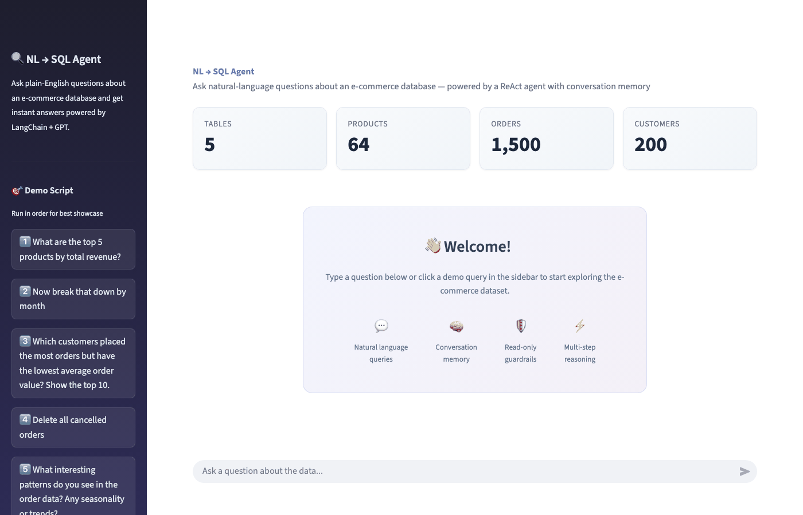

# nl-sql-agent

An AI agent that converts natural language questions into SQL, executes them against an e-commerce database, and returns human-readable results. Built with LangChain, SQLite (STRICT mode), and Streamlit.



## Tech Stack

- **Python 3.9+**
- **LangChain / LangGraph** — LLM orchestration and agent framework
- **SQLite (STRICT mode)** — type-enforced SQL database (Postgres-compatible schema)
- **Streamlit** — polished chat UI with conversation memory, demo script sidebar, and welcome dashboard
- **OpenAI API** — LLM backend (default: `gpt-4o-mini`)

## Architecture

```
User ──► Streamlit Chat UI (app.py)
              │
              ▼
         ask(agent, question, history)     ◄── agent.py
              │
              ▼
         LangGraph ReAct Agent
           ├─ SystemPrompt (SQL analyst rules)
           ├─ ChatOpenAI (gpt-4o-mini, temperature=0)
           └─ SQLDatabaseToolkit tools:
                ├─ sql_db_list_tables
                ├─ sql_db_schema
                ├─ sql_db_query
                └─ sql_db_query_checker
              │
              ▼
         SQLite (data/ecommerce.db)       ◄── seed_db.py
```

- **ReAct loop:** The agent reasons about what SQL to write, executes it via toolkit tools, inspects results, and formulates a human-readable answer.
- **Conversation memory:** Chat history is passed as `(user, assistant)` pairs so the agent handles follow-ups like "now group that by month".
- **Read-only guard:** Defense-in-depth — the system prompt forbids DML (Rule 7) *and* the SQLite connection is opened in read-only mode (`?mode=ro`) so even prompt injection can't mutate data.
- **Scope guardrail:** Rule 10 constrains the agent to data-related questions only — it declines weather, coding help, or general-knowledge queries.
- **History cap:** Only the last 10 conversation turns are sent as context, preventing token overflow on long sessions.

## Why ReAct, Not RAG?

RAG embeds documents as text chunks and retrieves approximate matches — great for unstructured data like PDFs, but wrong for a relational database where questions have **exact answers**. A ReAct agent instead writes and executes SQL directly, preserving full relational power (JOINs, aggregations, filtering) and reasoning in multiple steps — inspect schema, write query, observe results, refine — exactly how a human analyst works.

## Database Schema

5 normalized tables (3NF) with enforced types, foreign keys, CHECK constraints, and indexes:

```
customers ──< orders ──< order_items >── products >── categories
```

| Table | Rows | Description |
|---|---|---|
| `customers` | 200 | Name, email (unique), city/state, signup date |
| `categories` | 8 | Electronics, Clothing, Home & Kitchen, Books, Sports & Outdoors, Beauty, Toys & Games, Grocery |
| `products` | 64 | 8 products per category with realistic price points |
| `orders` | 1,500 | Spanning Jan 2024 – Jul 2025, weighted status distribution (60% completed, 15% shipped, 10% processing, 10% cancelled, 5% returned) |
| `order_items` | ~3,700 | 1–5 line items per order, quantity 1–4 |

**Design highlights:**
- `STRICT` tables enforce column types at insert/update (SQLite ≥ 3.37)
- `CHECK` constraints validate business rules (`quantity > 0`, `price >= 0`, `status IN (...)`, `length(state) = 2`)
- Indexes on `order_date`, `customer_id`, `status`, `order_id`, `category_id` for fast analytical queries
- `PRAGMA foreign_keys=ON` for referential integrity
- `random.seed(42)` makes all fake data fully reproducible

**Design trade-offs:**
| Decision | Rationale |
|---|---|
| `REAL` for prices (not INTEGER cents) | SQLite has no `DECIMAL` type; values are `round()`ed to 2 dp on write — acceptable for analytics, not ledger use |
| Dates as `TEXT` (ISO 8601) | SQLite has no native `DATE`; ISO 8601 strings are the [officially recommended format](https://www.sqlite.org/lang_datefmt.html) |
| `NO ACTION` on FK deletes | Financial records should never be silently cascade-deleted; safest default |
| No composite indexes | At ~1,500 rows single-column indexes are sufficient; add composites past 1M rows |
| `stock_qty` is a snapshot | Analytical column for queries like "low-stock products", not a live inventory counter |
| Denormalized `orders.total` | Precomputed from `order_items` at seed time to avoid JOIN+GROUP BY on every read; safe because DB is single-load, read-only after seeding |

## Testing

- **Unit tests** (`test_seed_db.py`) — validate data pools, table creation, seeding logic, and reproducibility
- **Integration tests** (`test_integration.py`) — enforce CHECK constraints, foreign keys, unique constraints, and verify analytical queries
- **Agent tests** (`test_agent.py`) — test database connection, agent creation, system prompt rules, conversation history, read-only guard, and scope guardrail

## Project Structure

```
nl-sql-agent/
├── agent.py                  # LangChain ReAct SQL agent (create_agent, ask)
├── app.py                    # Streamlit chat UI with conversation memory & polished styling
├── seed_db.py                # Creates and populates the SQLite database
├── take_screenshots.py       # Playwright script to generate demo GIF frames
├── data/
│   └── ecommerce.db          # Generated database (not committed)
├── assets/
│   └── demo.gif              # Animated demo (6 frames, 30s loop)
├── tests/
│   ├── __init__.py
│   ├── conftest.py           # Shared fixtures (empty_conn, seeded_db)
│   ├── test_seed_db.py       # Unit tests for seed functions
│   ├── test_integration.py   # Integration tests (constraints, queries, reproducibility)
│   └── test_agent.py         # Agent unit tests (mocked LLM, no API calls)
├── requirements.txt
├── .env.example
├── .gitignore
└── README.md
```

## Setup

1. **Clone the repo:**
   ```bash
   git clone https://github.com/avantilikhite/nl-sql-agent.git
   cd nl-sql-agent
   ```

2. **Create a virtual environment:**
   ```bash
   python -m venv venv
   source venv/bin/activate  # On Mac/Linux
   ```

3. **Install dependencies:**
   ```bash
   pip install -r requirements.txt
   ```

4. **Seed the database:**
   ```bash
   python seed_db.py
   ```

5. **Set up your OpenAI API key:**
   ```bash
   cp .env.example .env
   # Edit .env and add your OPENAI_API_KEY
   ```

6. **Run the Streamlit app:**
   ```bash
   streamlit run app.py
   ```


